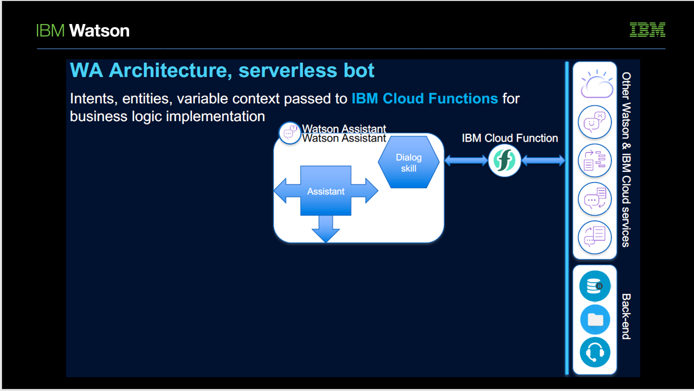
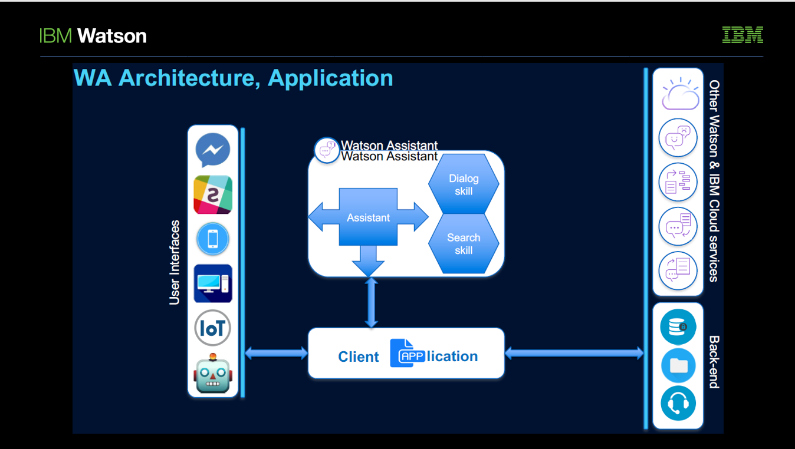
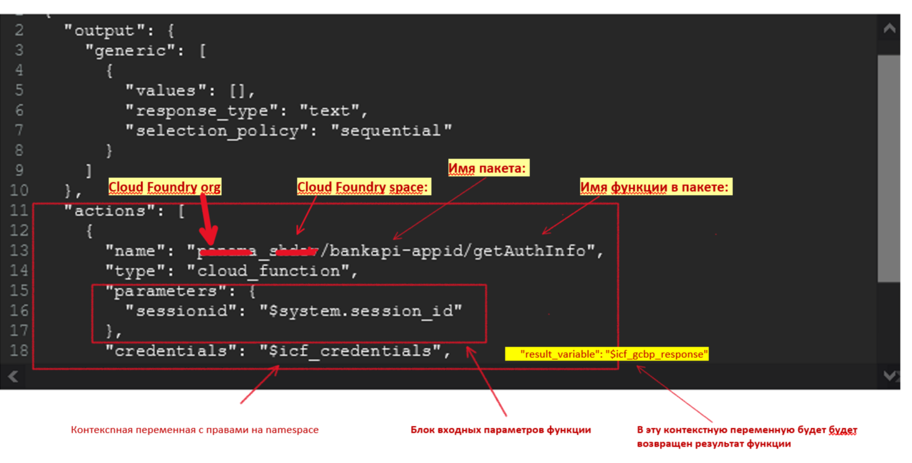
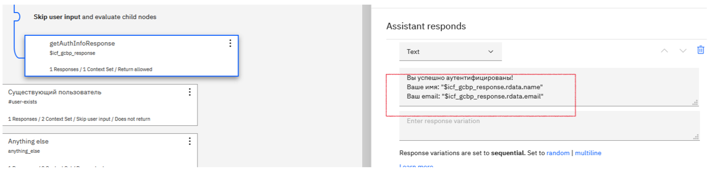
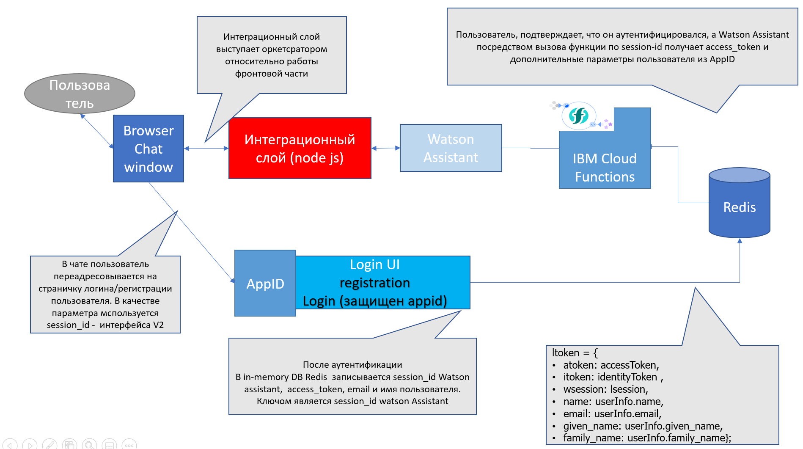

# Интеграционные решения с использованием Watson Assistant

<!-- TOC BEGIN -->

1. [Цель работы](#p1)
1. [Возможные инструметы интеграции с Watson Assistant](#p2)
1. [Интеграция c помощью IBM Cloud Functions ](#p3)
1. [Интеграция с помощью Custom Application](#p4)
1. [Пример комплексной интеграции](#p5)

<!-- TOC END -->

## Цель работы
Целью этой работы является построение модели виртуального ассистента на базе Watson Assistant с использованием нескольких вариантов интеграции.

## Возможные инструменты интеграции с Watson Assistant

Возможные варианты интеграции с Watson Assistant показаны на фото:

<kbd></kbd>

pic-1

В этой работе мы рассмотрим интеграцию с помощью IBM Cloud Functions
<kbd></kbd>

pic-2

и через Custom integration - через клиентское приложение:.

<kbd></kbd>

pic-3

Пример встраивания Watson Assistant в существующую архитектуру банка показан на фото:
<kbd></kbd>

pic-4

## Интеграция с помощью IBM Cloud Functions

Удобным способом вызова внешних сервисов из Watson Assistant являются IBM Cloud Functions. Вызов такой функции выполняется прямо из диалога Watson Assistant с помощью параметров в JSON-обьекте диалога. На фото показан пример вызова такой функции в дереве диалога:

<kbd></kbd>

pic-5

Для вызова нужно:

- создать контекстную переменную с правами доступа для вашего IBM Cloud Functions Namespace:

<kbd></kbd>

pic-6

- Оформить вызов функции:

<kbd></kbd>

pic-7</
p>

Готово! Watson Assistant готов отправлять запросы во внешнюю функцию (такая функция должна уже существовать).
Функция может возвращать иерархический набор данных. Как получить доступ к возвращаемым данным - показано на фото:

<kbd></kbd>

pic-8

## Интеграция через Custom Application

Для разработки интеграции со специфическими требованиями предоставляются SDK для большинства популярных платформ:

 <kbd></kbd>

pic-9

Ваш приложение может быть размещено как в облаке, так и on-Premises. Вы можете использовать один из двух вариантов интерфейса API  интеграции с Watson Assistant:

- v1: универсальный и широкий. С его помощью можно программно создавать и обновлять skill;

- v2: защищенный интерфейс только для обмена сообщениями. Имеет идентификатор сессии чата.

Такая интеграция необходима для разработки специфического интерфейса, вызовов дополнительных сервисов или интеграции с социальными сетями.

## Пример комплексной интеграции.

В качестве примера случая комплексной интеграции - (поддержка аутентификации пользователя во внутренней системе с использованием технологий OAuth 2.0) приведен пример с использованием сервиса IBM Cloud App-ID, который позволяет быстро и легко добавить такую аутентификацию в Web и мобильные приложения.

 <kbd></kbd>

pic-10

показан workflow процесса аутентификации.
